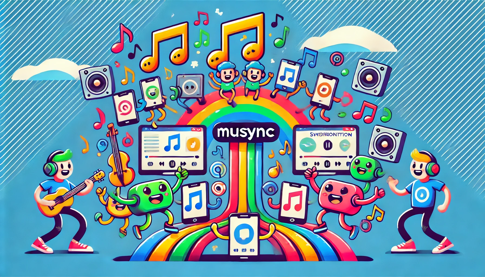

# 🎼 musync 🎶



<div align="center">


</div>

<div align="center">


</div>

Welcome to **musync**, the ultimate symphony conductor for your music libraries! Ever find yourself drowning in a sea of playlists between Spotify and Tidal? Wish your music could magically sync itself? Well, wish no more! **musync** is here to orchestrate harmony between your favorite music services.

## 🎤 What is this?

This project is built to sync my music. I'm using both Spotify and Tidal and I want to automatically synchronize my playlists. Also, I would like to design some automation processes to sort my libraries because, let’s face it, who has time for that?

## 🎧 Usage

While there aren't a ton of features yet (hey, Rome wasn't built in a day), there are a few requirements to get this musical maestro up and running. You'll need to set up some environment variables. In the current version, you can simply add a `.env` file to the project.

### 🎵 Spotify Setup 

In order to access private playlists, you will need to add the following environment variables to your `.env` file:

```
SPOTIFY_CLIENT_ID=<your-client-id>
SPOTIFY_CLIENT_SECRET=<your-client-secret>
SPOTIFY_REDIRECT_URI=<your-redirect-uri>
```

You can look up the values for these variables in [Spotify's developer dashboard](https://developer.spotify.com/dashboard). For `SPOTIFY_REDIRECT_URI`, you can use `http://localhost:8080/callback` for local development. Make sure to add the URI to your Spotify App because even your app needs to know where the party is at.

### 🎶 Tidal Setup 

Tidal authenticates over the browser. When you run the project, you will see a link prompted in the stdout. Click on the link to open your browser and complete the authentication process. Easy peasy!

## 🥁 Features (or lack thereof)

- Sync your playlists between Spotify and Tidal (or at least we hope to).
- Automate sorting of your music libraries because chaos is for the mosh pit, not your playlists.
- More awesome features to come (eventually)!

## 🚀 Getting Started

1. Clone this repo. It’s the coolest thing you’ll do today.
2. Set up your `.env` file with the necessary Spotify credentials.
3. Run the project and watch the magic happen.

## 💡 Pro Tips

- Make sure your `SPOTIFY_REDIRECT_URI` is the same in both your `.env` file and Spotify developer settings. Otherwise, the music gods will frown upon you.
- If something breaks, just turn it off and on again. Works every time.

## 🙏 Acknowledgements

Thanks to Spotify and Tidal for existing. Also, thanks to coffee for making this project possible.

---

Happy syncing, and may your playlists forever be in perfect harmony! 🎷
